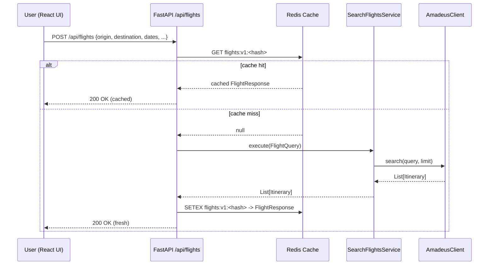
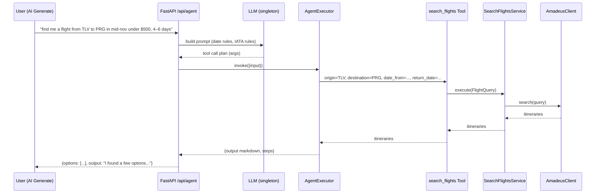

# ✈️ Flight Copilot — Building an AI Travel Assistant from Scratch

An educational end-to-end project that combines domain-driven design, FastAPI, LangChain, Redis caching, and a React frontend.

## 🧠 What is Flight Copilot?

Flight Copilot started as an experiment in bridging structured flight search logic (via APIs like Amadeus) with natural language interaction powered by an LLM.
Over time it grew into a full AI travel assistant with caching, modular provider support, and a web UI.

The idea:

“You type find me a flight from Tel Aviv to Prague in mid-November under $500, and the agent plans, queries the API, and explains the results conversationally.”

## 🧩 Architecture Overview

The project is built around clean layers:

```
src/
├── app/
│   ├── app.py                 # FastAPI entry point
│   ├── deps.py                # Dependency injection (Amadeus, SearchService, LLM)
│   └── routers/               # API routes: flights, agent, locations
│
├── core/
│   ├── entities.py            # Domain models (FlightQuery, Itinerary, Segment, Money)
│   ├── services.py            # SearchFlightsService (policy layer)
│   └── exceptions.py
│
├── infra/
│   ├── cache.py               # Redis cache (make_key, cache_get, cache_set)
│   └── airports/              # Local airport database + fuzzy search
│
├── llm/
│   ├── agent.py               # LangChain agent orchestrating tool-calling
│   ├── tools/
│   │   └── flight_tool.py     # StructuredTool wrapping the search service
│   └── prompts/               # Jinja2 / ChatPrompt templates
│
├── providers/
│   └── amadeus_client.py      # External flight API adapter
│
├── utils/
│   ├── llm.py                 # Singleton LLM instance (Groq/Ollama)
│   ├── logger.py
│   ├── flights.py             # Utility for FlightQuery construction
│   └── date_guard.py          # Detect & block invalid/past date queries
│
└── config.py / .env
```

Frontend lives in a separate folder (flight-copilot-ui/) built with React + Tailwind + Typewriter animation.

## 🏗 Step by Step — How It Works

1. Domain Core

At the heart are small, immutable dataclasses like FlightQuery, Itinerary, and Money.
They describe what a flight search is, not how it’s done.

```
@dataclass
class FlightQuery:
    origin: Airport
    destination: Airport
    date_from: date
    return_date: Optional[date]
    max_price: Optional[int]
    nonstop: bool = False
```

---

2. Service Layer

SearchFlightsService takes any provider that follows the FlightProvider protocol:

```
class FlightProvider(Protocol):
    def search(self, query: FlightQuery, limit: int = 10) -> List[Itinerary]: ...
```

This means you can swap AmadeusClient for Skyscanner, Airlabs, or another adapter without touching the rest of the system.

---

3. Infrastructure

To avoid expensive API calls, we use a small Redis cache:

```
from src.infra.cache import make_key, cache_get, cache_set

key = make_key(provider, req)
cached = cache_get(key)
if cached:
    return FlightResponse(**cached)
```

make_key() builds a normalized, hashed payload of all query parameters.

---

4. LLM Integration

We use LangChain’s StructuredTool to make flight search callable by an agent.

```
def search_flights_tool(provider):
    service = SearchFlightsService(provider)

    def _run(origin, destination, date_from, return_date=None, max_price=None):
        q = FlightQuery(...parsed args...)
        return service.execute(q)

    return StructuredTool.from_function(func=_run, name="search_flights")
```

---

5. Agent Layer

The LLMAgent builds a one-time Chat + Tool executor:

agent = create_tool_calling_agent(llm, tools=[search_flights_tool])
executor = AgentExecutor(agent=agent, tools=[search_flights_tool])

When you call /api/agent, it: 1. Validates natural-language dates. 2. Lets the model decide how to call the search_flights tool. 3. Returns both structured flight data + natural text output.

---

6. Web API (FastAPI)

Two key endpoints:

- POST /api/flights → deterministic search by JSON body.
- POST /api/agent → natural-language interface (“find me a flight…”).

All providers and services are resolved via dependency injection from app/deps.py.

---

7. Frontend

Built in React + Vite + Tailwind.
The AIGeneratePage.tsx animates the LLM’s markdown output with a custom MarkdownTypewriter component.

```
<MarkdownTypewriter
  content={results.output}
  speed={5}
  onComplete={() => setShowResults(true)}
/>
```

## 🧠 What I Learned

- How to design LLM-powered tools that stay deterministic and modular.
- The importance of cache normalization when APIs are expensive.
- How to wrap third-party APIs behind a clean FlightProvider abstraction.
- Balancing prompt flexibility with schema safety.
- Using LangChain’s AgentExecutor directly with FastAPI endpoints.

## 🧰 Tech Stack

Layer Tech
Backend FastAPI, Python 3.12, LangChain
Providers Amadeus API (pluggable)
Cache Redis 7 (Docker)
LLM Groq (Qwen3-32B) / Ollama (local models)
Frontend React, TypeScript, TailwindCSS
Infra Docker Compose, .env-based config

## ⚙️ Setup

git clone https://github.com/yourusername/flight-copilot.git
cd flight-copilot
python -m venv .venv && source .venv/bin/activate
pip install -r requirements.txt

Create a .env file:

```
AMADEUS_CLIENT_ID=your_id
AMADEUS_CLIENT_SECRET=your_secret
AMADEUS_AUTH_URL=https://test.api.amadeus.com/v1/security/oauth2/token
AMADEUS_FLIGHTS_URL=https://test.api.amadeus.com/v2/shopping/flight-offers
GROQ_API_KEY=your_key
MODEL_NAME=qwen/qwen3-32b
REDIS_URL=redis://localhost:6379
USE_VERBOSE=false
FLIGHT_CACHE_TTL_SEC=1800
```

Run backend:

```
uvicorn src.app.app:app --reload --port 8000
```

Run frontend:

```
cd flight-copilot-ui
npm install
npm run dev
```

## 🗺️ Next Steps

- 🧭 Add conversational short-term memory (SQLite or vector store).
- 🌤 Weather / destination mood insights.
- 🧳 Integrate booking or price-tracking providers.
- 🧠 More robust intent classification (non-flight queries → polite fallback).

---

awesome — here are two Mermaid diagrams you can drop straight into your README to make it way more educational:

# 🧩 System Architecture (Mermaid)

```mermaid
flowchart LR
  subgraph Client[Frontend (React + Tailwind)]
    UI[Search Form / AI Generate Page]
  end

  subgraph API[FastAPI Backend]
    R1[/POST /api/flights/]
    R2[/POST /api/agent/]
    DEPS[Dependency Injection<br/>get_llm · get_provider · get_service]
    SVC[SearchFlightsService]
    AGENT[LangChain Agent + Tool]
    TOOL[StructuredTool: search_flights]
    CACHE[Redis Cache<br/>make_key / get / set]
  end

  subgraph Domain[Core Domain]
    ENT[Entities<br/>FlightQuery · Itinerary · Segment · Money]
  end

  subgraph Providers[Providers]
    AMA[AmadeusClient<br/>(HTTP)]
    (Other)[…future providers…]
  end

  UI -->|JSON body / NL prompt| R1
  UI -->|NL prompt| R2

  R1 --> CACHE
  CACHE -- miss --> R1
  R1 --> SVC --> ENT
  SVC --> AMA
  AMA --> SVC
  SVC --> CACHE
  R1 --> UI

  R2 --> DEPS --> AGENT
  AGENT --> TOOL --> SVC
  R2 --> UI

  style CACHE fill:#F0FFF4,stroke:#10B981,stroke-width:1px
  style AGENT fill:#EEF2FF,stroke:#6366F1,stroke-width:1px
  style TOOL fill:#EEF2FF,stroke:#6366F1,stroke-width:1px
  style AMA fill:#FFF7ED,stroke:#F59E0B,stroke-width:1px
```

🔁 Request Lifecycle — Flight Search (Sequence)



🧠 Agent Flow — Natural Language to Flights (Sequence)


