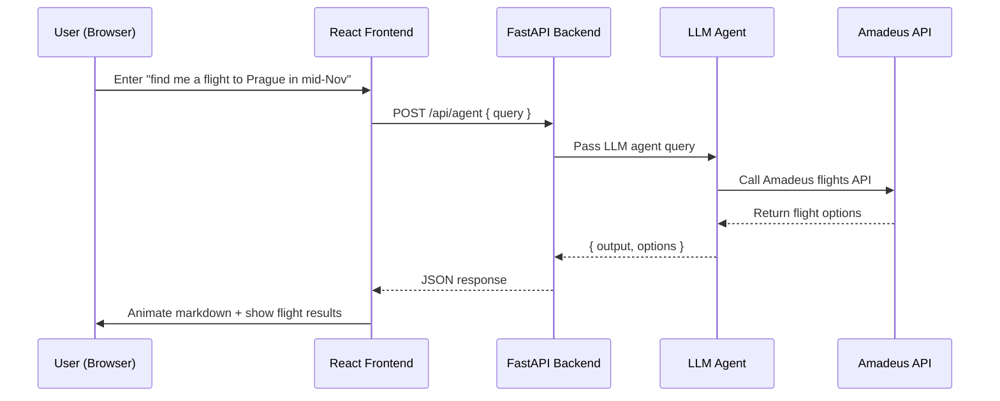

# 🧭 Flight Copilot UI

A modern AI-powered flight search interface built with React, TypeScript, TailwindCSS, and Vite — the frontend companion to the Flight Copilot backend.

### ✨ Overview

The UI provides a clean and interactive way to communicate with the backend agent (/api/agent) and structured flight API (/api/flights).
Users can type natural language prompts (e.g., “find me a flight from Tel Aviv to Rome next month under $400”) and see streamed markdown responses rendered with a typewriter animation.

### 🧩 Tech Stack

Layer Tech
Framework React + TypeScript
Build Tool Vite
Styling TailwindCSS
Animation Custom MarkdownTypewriter (ReactMarkdown + remark-breaks)
HTTP Axios (with /api proxy)
LLM Integration Calls FastAPI /api/agent and /api/flights endpoints
State Management Local component state + hooks
Dev Environment Node 18+

### 🗂 Project Structure

```
flight-copilot-ui/
├── public/
├── src/
│   ├── api/
│   │   ├── agent.ts                # POST /api/agent
│   │   ├── client.ts               # axios instance (baseURL /api)
│   │   └── flights.ts              # POST /api/flights
│   │
│   ├── components/
│   │   ├── common/
│   │   │   ├── InputText.tsx
│   │   │   ├── AirportInput.tsx
│   │   │   ├── DateRangePicker.tsx
│   │   │   ├── FlightLeg.tsx
│   │   │   ├── FlightResultCard.tsx
│   │   │   ├── FlightsList.tsx
│   │   │   └── MarkdownTypewriter.tsx
│   │   ├── FlightSearchForm.tsx     # search form (uses common/*)
│   │   └── (UI atoms live in common/)
│   │
│   ├── hooks/
│   │   ├── useAIGeneratePrompt.ts
│   │   ├── useAirports.ts
│   │   ├── useDebounced.ts
│   │   └── useSearchFlights.ts
│   │
│   ├── mocks/
│   │   ├── agent-response.json
│   │   ├── amadeus.json
│   │   └── new-flights.json
│   │
│   ├── pages/
│   │   ├── AIGeneratePage.tsx       # NL/agent mode
│   │   └── FlightSearchPage.tsx     # structured mode
│   │
│   ├── types/
│   │   └── flight.ts                # shared TS types: IFlight, ILeg, etc.
│   │
│   ├── utils/
│   │   ├── index.ts                 # helpers (formatting, etc.)
│   │   ├── App.tsx                  # router + layout
│   │   ├── index.css                # Tailwind + custom tweaks
│   │   └── main.tsx                 # app bootstrap
│   │
│   ├── vite-env.d.ts
│   └── index.html
│
├── .env                             # VITE_API_URL (optional; default /api)
├── package.json
├── tsconfig.json
├── tsconfig.app.json
├── tsconfig.node.json
├── vite.config.ts
└── README.md
```

### 🚀 Setup & Run

1️⃣ Install dependencies

```
cd flight-copilot-ui
npm install
```

2️⃣ Configure environment

Create a .env file (for local dev):

```
VITE_API_URL=http://localhost:8000
VITE_USE_MOCK=false
```

3️⃣ Start the dev server

```
npm run dev
```

Vite will start at http://localhost:5173.

Make sure your backend is running on port 8000:

```
uvicorn src.app.app:app --reload --port 8000
```

### 🧠 Key Components

🔹 AIGeneratePage.tsx

Handles the natural language interaction with /api/agent.
Displays the LLM’s markdown output gradually using a custom typewriter animation.

<MarkdownTypewriter
content={results.output}
speed={5}
onComplete={() => setShowResults(true)}
/>

🔹 MarkdownTypewriter.tsx

An enhanced markdown renderer combining ReactMarkdown + remark-breaks with typing effect support.

### 🧭 How It Works (Flow)



### 💡 Development Notes

    •	The UI uses relative API paths (/api/...) for local proxying, so you can run frontend and backend independently.
    •	The MarkdownTypewriter ensures multiline formatting and proper paragraph spacing.
    •	Results are rendered in a scrollable container with consistent spacing and typography (using Tailwind’s prose plugin).

### 🧩 Next Ideas

    •	🌗 Add dark/light theme toggle.
    •	📅 Integrate date picker for structured form mode.
    •	💬 Add short-term chat memory (frontend-side).
    •	🧭 Display flight cards visually (airline logos, times).

### 🧱 Commands Summary

Command Description
npm run dev Start Vite development server
npm run build Create production build
npm run preview Preview production build locally

---
